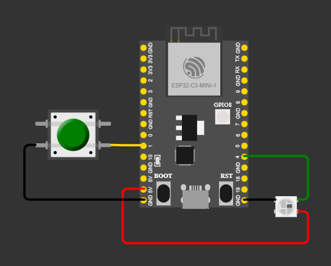

# ESPHome-yaml
Some ESPHome configurations made by me.

These might give someone ideas how to make their own device configuratios
## ESP32-C3 Button with Led
- esp32c3-button-led.yaml (ESPHome)
- esp32c3-button-led-automation.yaml (automation example)

ESPHome configuration for an ESP32-C3 microcontroller with a single WS2812B addressable RGB LED controlled via GPIO push button. Features:

- Button Interactions: Single click (blue), double click (red), long press (green pulse), and press feedback (white)
- Status Indicators: LED blinks yellow during WiFi connection, blue during OTA updates, and orange when WiFi disconnects
- Persistent Colors: Save and restore custom base LED colors through Home Assistant integration
- Smart States: LED returns to user-defined base color after actions complete
- Home Assistant Events: Sends button events to Home Assistant for automation triggers

## Keypad 

- wemos-d1-keypad.yaml

[Wemos D1 mini](https://www.wemos.cc/en/latest/d1/d1_mini.html) board connected to 4x4 [matrix keypad](https://next.esphome.io/components/matrix_keypad/) to control alarm

ESPHome configuration for a Wemos D1 Mini-based alarm control keypad with 4x4 matrix input and APA106 LED feedback. Features:
- 4x4 Matrix Keypad: 16-key layout (0-9, *, #, A-D) for alarm control and PIN entry
- Four Alarm Modes:
  - A = Arm Away (red LED)
  - B = Arm Home (red LED)
  - C = Arm Vacation (green LED)
  - D = Disarm (blue LED)
- 8-LED RGB Strip Feedback: Visual indicators for key presses and PIN entry progress
- PIN Code Entry: Collects numeric codes with backspace (*) and clear (#) support
- Home Assistant Integration: Sends alarm commands with PIN authentication to HA alarm panel
- Status Indication: LED blinks white during code entry, displays mode-specific colors on key press

## 8 leds & keys

[Wemos D1 mini](https://www.wemos.cc/en/latest/d1/d1_mini.html) board connected to [TM1638 7 Segment Display Keypad & LED Module](https://next.esphome.io/components/display/tm1638/) 

### 8 leds & keys
- wemos-d1-8ledkeys.yaml

This ESPHome configuration turns a Wemos D1 Mini with a
TM1638 module into a simple 8‑button, 8‑LED control panel.
The display shows the current time when Home Assistant time is available, and a wave animation until connection is ready.
Buttons only publish their state.
LEDs can be controlled from Home Assistant or automations.

### 8 leds & keys
- wemos-d1-8ledkeys-tapo.yaml
- wemos-d1-8ledkeys_HA-Automation.yaml

 Show time
- Control TP-Link Tapo P115 plugs connected to Home assistant

Smart Home Plug Control Panel with TM1638 Display & 8 Buttons

ESPHome configuration for a Wemos D1 Mini with TM1638 LED display module and 8 programmable buttons. Features:

- 8 Buttons + 8 LEDs: Each button controls a corresponding Home Assistant smart plug (on/off toggle)
- Visual Feedback: Individual red LEDs indicate plug status in real-time
- 7-Segment Display: Shows live clock (HH:MM:SS format) from Home Assistant
- Button Animation: Display flashes bars/animation on selected digit when button is pressed
- Plug State Sync: LED reflects live plug state, syncs automatically when Home Assistant connection established
- Substitution Support: Easily map buttons to any Home Assistant switch entity (pre-configured for Tapo smart plugs)
- Bidirectional Control: Buttons toggle plugs, LED updates reflect actual plug status from HA
